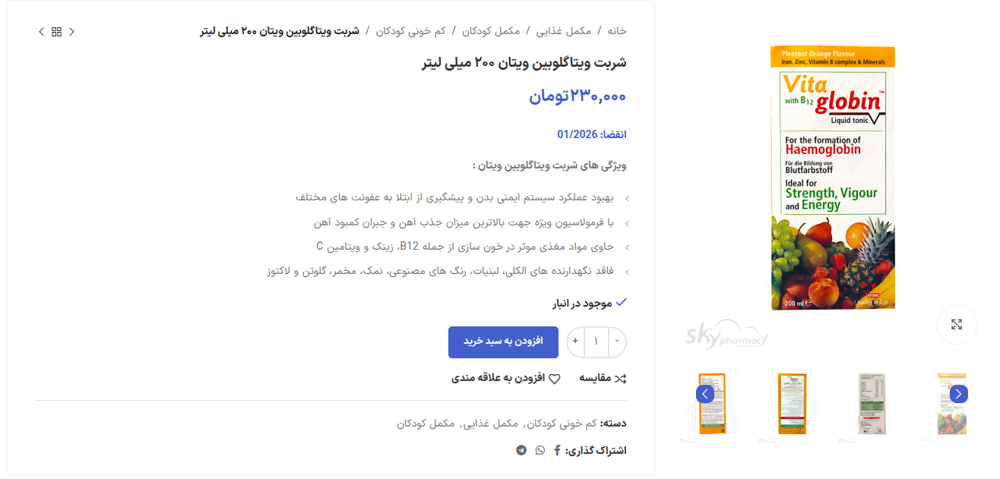

# WooCommerce Product Expiration Plugin

This WordPress plugin allows WooCommerce store owners to set an expiration date for products. Once a product is two months away from expiration, it will be marked as "Out of Stock" and an email notification will be sent to all administrators and shop managers.

## Features
✅ Add an expiration date to products via the product edit page or Quick Edit.  
✅ Display the expiration date on the product page after the price.  
✅ Automatically set products to "Out of Stock" when they are two months away from expiration.  
✅ Send an email notification to WooCommerce administrators and shop managers when a product is expiring soon.  
✅ Fully compatible with WooCommerce.

## Installation
1. Upload the plugin folder to the `/wp-content/plugins/` directory.  
2. Activate the plugin through the **Plugins** menu in WordPress.  
3. Edit a product and set the expiration date under **Product Data → General**.  
4. (Optional) Use Quick Edit in the product list to modify the expiration date quickly.

## Screenshot

## Usage
- When a product is close to expiration (2 months remaining), it will automatically be set to "Out of Stock."
- Administrators and Shop Managers will receive an email with product details, including a direct edit link.
- The expiration date will be displayed on the product page in `MM/YYYY` format.

## Support
For any issues or feature requests, please open a GitHub issue or contact us through the WooCommerce support forum.

## Changelog

### Version 2.10
- Added: Configurable date format options (Y/m/d, Y/m, Ym, etc.)
- Added: Custom styling for expiration dates with expiration-date class
- Added: Improved display of expiration dates in product pages, cart, and order emails
- Fixed: Persian language translation issues
- Fixed: Date format localization and display
- Improved: Expiration date styling and container
- Added: Support for Persian calendar date display when jdate is available
- Added: Complete POT and PO translation files
- Optimized: Admin interface for expiration date management

### Version 1.0.4
- Improved: Enhanced variation details in expiration notification emails
- Added: Parent product name and ID display for variations
- Added: Formatted variation attributes listing
- Optimized: Combined query for simple and variable products

### Version 1.0.3
- Fixed: Products without expiration dates being incorrectly marked as out of stock
- Added: Additional validation for expiration date format
- Added: Only process products that are currently in stock

---
Developed with ❤️ for WooCommerce store owners!

